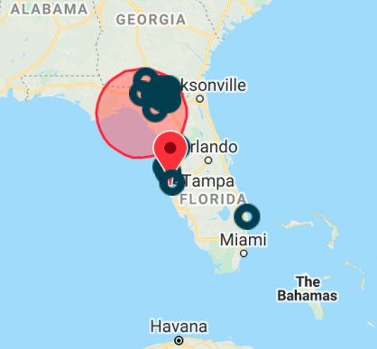

# SafeSpot App

## Problem Statement:

When a hurricane or tropical storm hits close to home, it can be hard to process the information available and take appropriate actions to insure one's safety. The information is not all located in one place, and often consists of complicated maps and jargon. This can increase cognitive load and anxiety in a stressful situation. The SafeSpot app aims to consolidate and simplify the necessary information for the user, including current storm location, size, category and wind speed, all watches and warnings currently in effect (as well as changes to watches and warning since the last update), an interactive map to determine one's evacuation zone, an interactive emergency checklist, and a map tool for finding available shelters and directions to them. SafeSpot debuted in the first week of July, 2021, and was successful in providing info for Hurricane / Tropical Storm Elsa. It is currently avaiable for residents of Florida (USA).

## Team:

### Data Science

* Christina Holland - https://www.linkedin.com/in/christina-holland-7400a1140/ (LinkedIn), https://christinaholland.github.io/ (Portfolio)
* Zecheng (Trevor) Chang - https://www.linkedin.com/in/zecheng-chang/

### Software Engineering

* Edgard Jara - https://www.linkedin.com/in/edjape/
* Benjamin Ritter - https://www.linkedin.com/in/benjamin-ritter-46b2a9105/

### User Experience

* Julia Bu - https://www.linkedin.com/in/juliabu/
* Collen Chin - https://www.linkedin.com/in/colleen-chin/
* Emily Malcolm - https://www.linkedin.com/in/emilymalcom/

## Links:

### * Video demo: 

https://drive.google.com/file/d/16Uwb50-TGA6y1P8ABcAfU8owUFiR-CEw/view?usp=sharing

### * Presentation: 

https://www.figma.com/proto/Qd5VdQsmcdln7HyQX6FEld/Blue-Barracuda?page-id=4%3A2&node-id=285%3A1625&viewport=139%2C223%2C0.06891253590583801&scaling=contain

### * Deployed app: 

https://safespot-hurricane-app.herokuapp.com/

### * Backend app: 

https://safespot-flask.herokuapp.com/alerts and https://safespot-flask.herokuapp.com/shelters

## Files:

This particular github is my personal working area for the UX survey data and the feed from the National Hurricane Center.

| file/directory | description |
| --- | --- |
| nhcfeedparser.py | This file runs on the command line and parses the NHC live RSS feed into the desired information, and saves it as JSON for the software team. It was later incorporated into the FLASK backend of the app. |
| nhcfeedparser_testing.ipynb | This is my working / experimentation space, used in developing nhcfeedparser.py. |
| survey_data_analysis | Directory, used to visualize the results of the first user survey and interview, to aid the focus of the app development. |
| survey_data_analysis/plot_survey_data.ipynb | Notebook for survey and interview data visualization. |
| survey_data_analysis/survey.csv | Survey data from the UX team. |
| survey_data_analysis/interviews.csv | Notes from the UX team interviews. |
| input_data | Directory, used for static example NHC feeds for app development. |
| input_data/archive_feed | Example feed from 2013 when a storm was present in the Gulf of Mexico. |
| input_data/nostormfeed | Example feed when NO storm was present in the Gulf of Mexico. |
| output_data | Directory, used for .csv and JSON output files for backend of app. |
| output_data/test.csv and currentstorminfo.csv | Old files, when we weve trying to use .csv for the backend of the app. |
| output_data/testjsondata.txt | Converted output to JSON. |
| output_data/testnumericcoords.txt | Converted the storm latitude and longitude to numeric (vs. string). |
| output_data/testnumericvalues.txt | Converted other variables to numeric as needed. |
| output_data/stormdata.txt | Sample output of final code. |
| output_data/mondayadv.txt | Saved output for Monday July 5, 2021 - Hurricane Elsa. |
| output_data/wedadv.txt | Saved output for Wednesday July 7, 2021 - Tropical Storm Elsa. |

